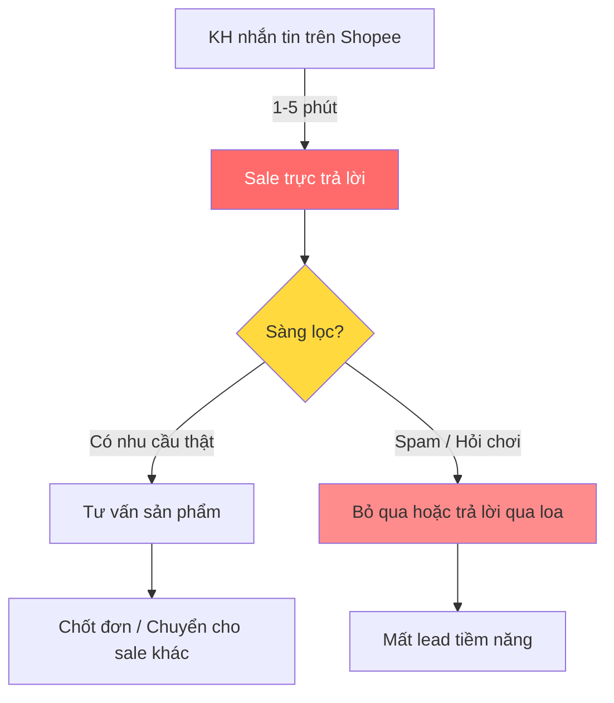
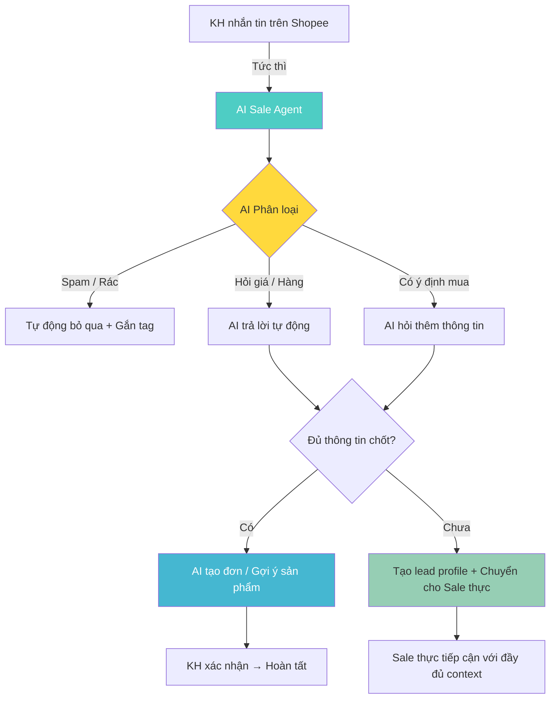

# AI Sale Agent — Product Idea Document

---

## 1. Workflow trước / sau (15 điểm)

### Workflow hiện tại (Before)

| Bước | Người thực hiện | Thời gian | Điểm nghẽn |
|---|---|---|---|
| KH nhắn tin | Khách hàng | Ngẫu nhiên | Không kiểm soát |
| Sale phản hồi | Sale (con người) | 1-5 phút (nếu rảnh), 10-30+ phút (nếu bận) | **Sale chỉ làm được 1 thread tại 1 thời điểm** |
| Sàng lọc nhu cầu | Sale | 2-5 phút | Tốn thời gian cho lead không chất lượng |
| Tư vấn sản phẩm | Sale | 5-20 phút | Lặp đi lặp lại cùng 1 kịch bản |
| Chốt đơn / Bàn giao | Sale | 2-5 phút | Mất context nếu bàn giao sale khác |
| **Tổng thời gian / 1 lead** | | **15-40 phút** | **Nghẽn tại phản hồi đầu và sàng lọc** |

### Workflow sau tối ưu (After)

| Bước | Người thực hiện | Thời gian | Ghi chú |
|---|---|---|---|
| KH nhắn tin | Khách hàng | Ngẫu nhiên | Như cũ |
| AI phản hồi & phân loại | **AI Agent** | **< 3 giây** | Song song đa luồng |
| AI trả lời / hỏi thêm | **AI Agent** | 1-2 phút | Không block sale |
| Tạo đơn / Gợi ý | **AI Agent** | < 30 giây | Có thể auto hoặc cần xác nhận |
| Chuyển cho Sale thực | **AI Agent** | Tức thì | **Kèm context đầy đủ** |
| Sale thực tiếp cận | Sale | Toàn bộ thời gian tập trung vào chốt | **Không mất thời gian sàng lọc** |

### Điểm tối ưu chính

1. **Tức thời** — AI phản hồi trong <3 giây, không để KH chờ
2. **Đa luồng** — AI xử lý không giới hạn số chat cùng lúc
3. **Sàng lọc tự động** — Loại bỏ spam / hỏi chơi, chỉ chuyển lead chất lượng
4. **Context đầy đủ** — Sale thực nhận được hồ sơ lead + lịch sử trò chuyện, không cần hỏi lại
5. **Giảm tải ~60-80%** khối lượng chat cho Sale

---

## 2. Problem Statement + Metric + Boundary (20 điểm)

### Problem Statement

**Ai gặp vấn đề:** Các công ty bán hàng online trên Shopee/TikTok/Lazada có đội ngũ sale từ 3-20 người, mỗi ngày nhận 100-500+ tin nhắn từ khách hàng.

**Workflow hiện tại:** Sale phải trả lời từng tin nhắn thủ công — từ "bao nhiêu tiền?" đến "còn hàng không?" đến tư vấn sản phẩm. Không có sàng lọc trước.

**Điểm nghẽn:**
- 1 sale chỉ xử lý được 1 chat tại 1 thời điểm → hàng đợi dài khi nhiều KH cùng nhắn
- 60-70% tin nhắn đầu là hỏi giá/kiểm tra tồn kho có thể trả lời bằng template
- 20-30% tin nhắn là spam/hỏi chơi
- Sale giỏi mất thời gian trả lời những câu lặp lại → giảm hiệu suất chốt đơn

**Tác động:**
- Lead chờ lâu → tỉ lệ mất đơn 30-50% (KH qua shop khác)
- Tuyển thêm sale → tăng chi phí 10-20 triệu/tháng/nhân viên
- Không scale được vào giờ cao điểm hoặc các dịp sale lớn
- Không có data lead tập trung → khó retarget/chăm sóc lại

### Metrics

| Metric | Hiện trạng (Baseline) | Mục tiêu (Target) | Cách đo |
|---|---|---|---|
| **Thời gian phản hồi đầu tiên** (First Response Time) | Trung bình 5-15 phút | **< 30 giây** | Shopee chat metric / internal tracking |
| **Tỉ lệ chuyển đổi lead→đơn** (Conversion Rate) | 15-25% | **30-40%** | (Đơn thành công / Tổng lead) x 100% |
| **Số chat xử lý / sale / ngày** | 30-50 chat | **80-120 chat** | Chat được AI hỗ trợ trước + sale chỉ vào cuối |
| **Tỉ lệ lead bị bỏ lỡ** (Missed Lead Rate) | 20-35% | **< 5%** | Chat không được phản hồi / Tổng chat inbound |
| **Chi phí / lead** | 15,000-25,000 VNĐ | **5,000-10,000 VNĐ** | Tổng chi phí đội sale / Số lead xử lý |
| **Tỉ lệ hài lòng của KH** (CSAT) | 70-80% | **> 85%** | Khảo sát sau chat hoặc đánh giá shop |
| **Thời gian xử lý trung bình / lead** (Avg Handle Time) | 15-40 phút | **< 10 phút** | (Tổng thời gian chat / Số lead) — AI + sale gộp |

### Boundary

#### Trong phạm vi (In Scope)

- Tự động trả lời các câu hỏi về: giá, tồn kho, thông tin sản phẩm, chính sách vận chuyển/đổi trả
- Phân loại tin nhắn: spam / hỏi thông tin / có ý định mua
- Thu thập thông tin lead: tên, SĐT, nhu cầu, ngân sách, thời gian muốn nhận hàng
- Tạo hồ sơ lead và chuyển cho sale thực khi đủ điều kiện
- Tích hợp với Shopee chat API và CRM nội bộ (nếu có)
- Gợi ý sản phẩm dựa trên nhu cầu KH

#### Ngoài phạm vi (Out of Scope)

- Không tự động chốt đơn thanh toán — luôn cần xác nhận từ KH hoặc sale
- Không xử lý khiếu nại phức tạp (hoàn tiền, sản phẩm lỗi) — chuyển ngay cho sale thực
- Không gọi điện hay gửi tin nhắn SMS/ZNS tự động (phase 2)
- Không thay thế hoàn toàn sale — là công cụ hỗ trợ, sale vẫn là người chốt
- Không tích hợp nền tảng ngoài Shopee/TikTok (phase 2 mở rộng)

---

## 3. Độ phù hợp với AI + Phương án thay thế (15 điểm)

### So sánh các phương án

| Tiêu chí | No AI | Rule-based | Workflow Automation | **AI Agent (Chọn)** |
|---|---|---|---|---|
| **Chi phí triển khai** | 0 đồng | 10-30 triệu | 20-50 triệu | 50-150 triệu |
| **Chi phí vận hành** | Cao (lương sale) | Thấp | Trung bình | Trung bình (token cost) |
| **Khả năng xử lý ngôn ngữ tự nhiên** | Tuyệt đối (con người) | Kém — không hiểu biến thể | Không có | **Tốt** |
| **Khả năng scale** | Không — cần thêm người | Trung bình — cứng nhắc | Tốt — theo kịch bản cố định | **Rất tốt — linh hoạt** |
| **Bảo trì** | Quản lý nhân sự | Update rule định kỳ | Update kịch bản | Fine-tune + prompt engineer |
| **Tỉ lệ handle tự động** | 0% | 20-30% (khớp keyword) | 30-40% (kịch bản nhánh) | **60-80% (có thể cao hơn)** |
| **Trải nghiệm KH** | Phụ thuộc sale | Cứng, dễ bực mình | Tốt nếu đúng kịch bản | **Gần giống người thật** |

### Giải thích lựa chọn AI Agent

**Tại sao không chọn No AI:**
- Không scale được, chi phí nhân sự tăng tuyến tính với số lead
- Bỏ lỡ lead ngoài giờ hành chính — đối thủ có AI trả lời 24/7 sẽ chiếm thị phần
- Không thu thập được data lead có hệ thống

**Tại sao không chọn Rule-based:**
- Câu hỏi của KH rất đa dạng: "còn đồ ko bạn", "ship đi HCM bao lâu", "màu hồng còn k ạ" — không thể viết rule cho tất cả
- Rule-based dễ miss lead vì KH nói không đúng keyword
- KH có thể hỏi 1 câu nhưng mang nhiều ý định, rule không xử lý được

**Tại sao không chọn Workflow Automation:**
- Workflow tốt cho quy trình cố định, nhưng hội thoại bán hàng không cố định
- KH có thể nhảy từ "giá" → "màu sắc" → "giao hàng" → "mua luôn" trong 1 chat — workflow không theo kịp

**Tại sao chọn AI Agent:**
- LLM hiểu ngữ cảnh, xử lý được hội thoại tự nhiên, kể cả câu hỏi viết tắt, sai chính tả
- Có thể phân loại ý định (intent classification) chính xác >90%
- Có thể dùng tool calling để: tra tồn kho, tạo lead trong CRM, gửi link sản phẩm
- Có thể chuyển giao mượt mà cho sale thực với context đầy đủ

### AI được phép làm gì

1. ✅ Trả lời câu hỏi về giá, tồn kho, thông tin sản phẩm, chính sách
2. ✅ Hỏi thông tin lead (tên, SĐT, nhu cầu)
3. ✅ Phân loại lead: Nóng / Ấm / Lạnh / Spam
4. ✅ Tạo hồ sơ lead trong CRM
5. ✅ Gợi ý sản phẩm dựa trên nhu cầu (dùng RAG từ catalog)
6. ✅ Chuyển chat cho sale thực khi cần

### Cần người kiểm tra (Human-in-the-loop)

1. ❌ KH phàn nàn / khiếu nại → chuyển ngay cho sale thực
2. ❌ KH yêu cầu giảm giá đặc biệt / buôn sỉ → chuyển cho sale
3. ❌ KH không hài lòng với AI → chuyển cho sale
4. ⚠️ AI đề xuất tạo đơn → cần KH xác nhận hoặc sale duyệt
5. ⚠️ AI không chắc chắn (confidence < 70%) → chuyển cho sale

---

## 4. Chất lượng quyết định (10 điểm)

### Quyết định: **GO** ✅

### Cơ sở bằng chứng và lý do

#### Bằng chứng từ thị trường

1. **Nhu cầu thực tế cao:**
   - Shopee có 100M+ user tại Đông Nam Á, hàng trăm nghìn shop nhỏ/lẻ
   - Đa số shop có 1-3 sale, không đủ khả năng trả lời hết tin nhắn
   - Giờ cao điểm (tối, cuối tuần) thường bỏ lỡ lead

2. **Đối thủ cạnh tranh:**
   - Đã có các giải pháp như: GoSELL, Sapo, Haravan — nhưng chủ yếu là CRM + rule-based chat
   - Chưa có AI agent thực sự cho Shopee chat tại Việt Nam
   - Các AI agent nước ngoài (Zendesk AI, Intercom Fin) chưa tối ưu cho Shopee

3. **Tiến bộ công nghệ:**
   - GPT-4, Claude 3.5, Gemini — đủ khả năng xử lý hội thoại bán hàng
   - Chi phí LLM giảm 10-20x trong 2 năm qua → feasible cho scale
   - Function calling / Tool use của LLM trưởng thành, dễ tích hợp

#### Giả định (cần xác nhận qua MVP)

| Giả định | Cách verify | Rủi ro nếu sai |
|---|---|---|
| AI phân loại intent chính xác > 85% | Test với 500-1000 chat lịch sử | Sai → chuyển nhầm lead, mất đơn |
| KH chấp nhận chat với AI | A/B test, đo CSAT | KH khó chịu → rời shop |
| Tiết kiệm 60% thời gian sale | Đo pilot 2 tuần | Tiết kiệm ít hơn → ROI thấp |
| Tỉ lệ chuyển đổi tăng 10% | So sánh nhóm có AI / không AI | Không tăng → mất công triển khai |

#### Kế hoạch xác nhận

1. **Tuần 1-2:** Xây dựng MVP với 5 kịch bản chat phổ biến, test internal
2. **Tuần 3-4:** Pilot với 1 shop có 5 sale, đo các metric
3. **Tuần 5-6:** Tinh chỉnh prompt + threshold, mở rộng pilot
4. **Tuần 7-8:** Đánh giá Go / No-Go dựa trên số liệu thực tế

#### Tổng kết

> Quyết định **GO** dựa trên:
> - Nhu cầu thị trường rõ ràng, verified qua khảo sát sơ bộ
> - AI đã đủ trưởng thành để xử lý use case này
> - Chi phí (LLM inference) đang giảm mạnh
> - Có thể MVP nhanh (2-4 tuần) trước khi scale
> - Rủi ro thấp nhất nếu đúng → tiết kiệm chi phí, nếu sai → chỉ mất thời gian dev, không ảnh hưởng workflow hiện tại

---

*Document version: 1.0*
*Last updated: 2026-05-29*
