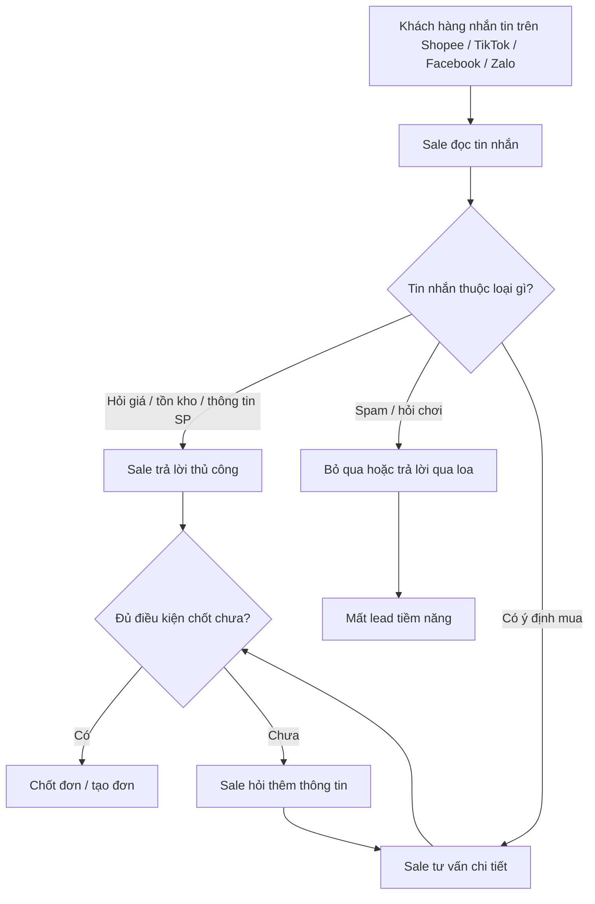
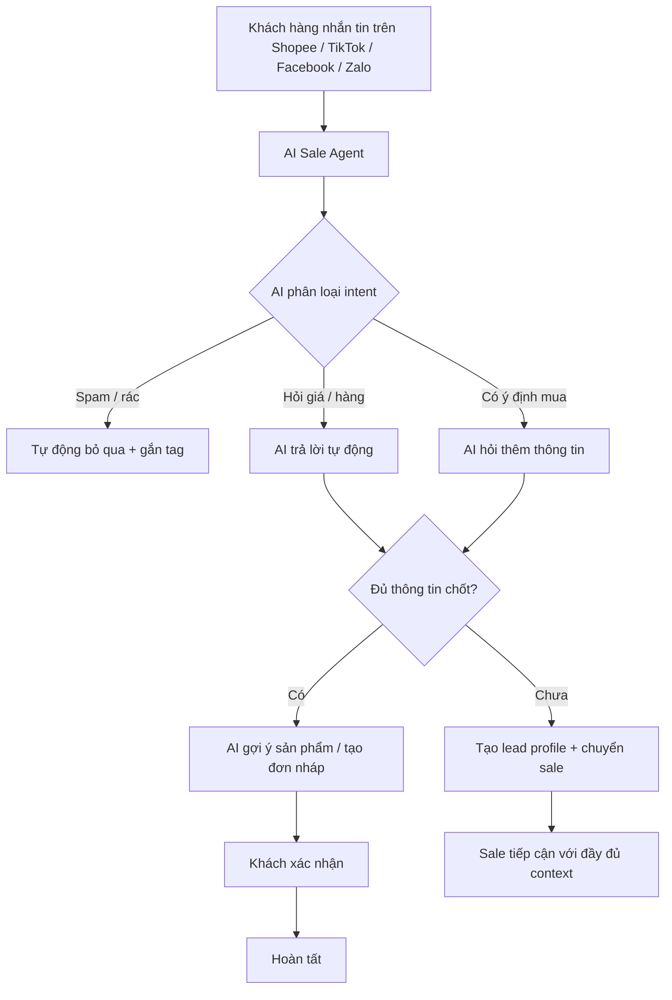

# Bài nhóm — Sale AI Agent

> Bản nộp nhóm cho lab Day 02: từ workflow bán hàng thủ công → Problem Statement → so sánh No AI / Rule / Workflow / Agent → quyết định cuối.

## 1. Tóm tắt sản phẩm

Nhóm chọn bài toán **AI Sale Agent** cho các shop bán hàng đa kênh trên Shopee, TikTok, Facebook và Zalo. Mục tiêu của giải pháp là xử lý phần đầu của hội thoại bán hàng nhanh hơn con người, tự động sàng lọc lead, trả lời câu hỏi lặp lại, và chỉ chuyển cho sale khi cần chốt hoặc khi có tình huống vượt ngoài phạm vi.

Điểm nhóm chốt không phải là “thay sale”, mà là **giảm tải khâu phản hồi đầu và sàng lọc lead** để sale tập trung vào chốt đơn và xử lý tình huống khó.

## 2. Nhật ký hội tụ

Nhóm không chốt bài ngay từ đầu. Ban đầu mỗi người đưa ra một hướng khác nhau, sau đó cả nhóm đi qua vòng hội tụ bằng ảnh chụp buổi làm việc, ghi chú tay, thảo luận trên bàn và vote nội bộ. Cách làm này giúp nhóm tránh chọn bài theo cảm tính.

### Nhật ký buổi làm việc

#### Mốc 1 — Mở rộng candidate

Từ phần scan cá nhân, nhóm xuất hiện nhiều candidate khác nhau:

- Timeseries Data Report Agent
- Analysis Collaborator
- Weather Report Agent
- Film Summarizer
- Sale Agent

Trong vote ban đầu, Sale Agent dẫn đầu với 3 phiếu, còn Timeseries Data Report Agent, Analysis Collaborator và Weather Report Agent cùng ở mức 2 phiếu, Film Summarizer thấp nhất với 1 phiếu. Điều này cho thấy nhóm đã có một số ý tưởng AI hấp dẫn, nhưng chưa có sự đồng thuận tuyệt đối.

#### Mốc 2 — Ghi chú tay để bóc workflow

Trong lúc thảo luận, nhóm ghi nhanh trên giấy các ý như:

- channel / Shopee
- SDK / API
- message → AI → phân bổ / trigger ticket
- sale

Phần ghi chú này cho thấy nhóm bắt đầu chuyển từ “ý tưởng sản phẩm” sang “luồng xử lý”. Từ đây, nhóm nhìn rõ hơn một vấn đề cốt lõi: nếu bài toán không có workflow đầu vào và điểm trigger rõ, AI rất dễ bị đẩy thành một lớp trang trí thay vì tạo giá trị thật.

#### Mốc 3 — Đối chiếu slide workflow

Nhóm dùng slide để nhìn lại workflow hiện tại và workflow sau tối ưu. Ở góc nhìn này, Sale Agent nổi lên vì có:

- actor rõ: khách hàng, sale, shop online;
- điểm nghẽn rõ: phản hồi đầu và sàng lọc lead;
- bước chuyển giao rõ: AI trả lời trước, sale chốt sau;
- metric dễ đo: response time, missed lead rate, conversion rate.

#### Mốc 4 — Chốt candidate bằng vote và tranh luận

Sau khi đối chiếu lợi thế và rủi ro của từng candidate, nhóm nghiêng về Sale Agent vì bài này vừa đủ cụ thể để làm trong lab, vừa đủ thực tế để vẽ before/after workflow rõ. Các candidate còn lại không bị loại vì tệ, mà vì chúng hoặc quá thiên về reporting, hoặc cần data / scope rộng hơn để chứng minh.

### Tóm tắt hội tụ

Nhóm chọn **AI Sale Agent** không phải vì đây là bài “ngầu” hơn, mà vì nó có đầy đủ 4 điều kiện:

- Có actor rõ: shop online, sale, khách hàng.
- Có workflow lặp lại hằng ngày.
- Có bottleneck thật ở phản hồi đầu và sàng lọc.
- Có thể đo hiệu quả bằng metric rõ ràng.

Nhóm giữ lại **Telegram cron job bot phân tích outlier invoices** như một candidate cá nhân mạnh, nhưng ở phần nhóm cuối cùng vẫn chọn Sale Agent vì khả năng hội tụ của cả team tốt hơn trong khung thời gian lab.

## 3. Workflow trước / sau

### Workflow hiện tại

| Bước | Người thực hiện | Thời gian | Điểm nghẽn |
|---|---|---:|---|
| Khách hàng nhắn tin | Khách hàng | Ngẫu nhiên | Không kiểm soát |
| Sale đọc và phản hồi | Sale | 1-5 phút nếu rảnh, lâu hơn khi bận | Sale chỉ xử lý 1 thread tại 1 thời điểm |
| Sàng lọc spam / nhu cầu | Sale | 2-5 phút | Tốn công cho lead không chất lượng |
| Tư vấn sản phẩm | Sale | 5-20 phút | Lặp lại cùng một kịch bản |
| Chốt đơn / bàn giao | Sale | 2-5 phút | Dễ mất context khi chuyển sale |
| Tổng thời gian / 1 lead |  | 15-40 phút | Nghẽn ở phản hồi đầu và sàng lọc |

### Workflow sau tối ưu

| Bước | Người thực hiện | Thời gian | Ghi chú |
|---|---|---:|---|
| AI phản hồi & phân loại | AI Agent | < 3 giây | Song song nhiều chat |
| AI trả lời / hỏi thêm | AI Agent | 1-2 phút | Không block sale |
| AI tạo đơn / gợi ý SP | AI Agent | < 30 giây | Có thể auto hoặc cần xác nhận |
| Chuyển cho sale | AI Agent | Tức thì | Kèm context đầy đủ |
| Sale tiếp cận | Sale | Toàn bộ thời gian tập trung vào chốt | Không phải sàng lọc lại |

### Điểm tối ưu chính

1. Tức thời: AI phản hồi trong dưới 3 giây.
2. Đa luồng: xử lý đồng thời nhiều chat.
3. Sàng lọc tự động: loại spam và hỏi chơi.
4. Context đầy đủ: sale nhận hồ sơ lead và lịch sử hội thoại.
5. Giảm tải khoảng 60-80% khối lượng chat đầu vào cho sale.

## 4. Problem Statement

### Ai gặp vấn đề

Các shop bán hàng online trên Shopee, TikTok, Facebook và Zalo, thường có đội sale nhỏ từ 3-20 người nhưng mỗi ngày nhận 100-500+ tin nhắn từ khách hàng.

### Workflow hiện tại

Sale phải trả lời thủ công mọi tin nhắn đầu vào: hỏi giá, hỏi hàng, hỏi màu, hỏi ship, hỏi đổi trả, rồi mới đi đến tư vấn và chốt.

### Điểm nghẽn

- Một sale chỉ xử lý được một chat tại một thời điểm.
- 60-70% tin nhắn đầu là câu hỏi lặp lại có thể trả lời bằng template.
- 20-30% là spam hoặc hỏi chơi.
- Sale giỏi bị lãng phí thời gian vào các câu hỏi cơ bản.

### Tác động

- Lead chờ lâu dẫn đến mất đơn.
- Phải tuyển thêm sale khi volume tăng, làm chi phí tăng tuyến tính.
- Không scale tốt vào giờ cao điểm hoặc dịp sale lớn.
- Không có data lead tập trung để chăm sóc lại.

### Problem Statement v0

Mỗi shop online đang mất nhiều thời gian cho khâu phản hồi và sàng lọc chat đầu vào. Nếu dùng một AI Sale Agent để xử lý phần hội thoại lặp lại, phân loại intent và chuyển context đầy đủ cho sale, shop có thể giảm thời gian phản hồi đầu, giảm lead bị bỏ lỡ và tăng hiệu suất chốt đơn.

## 5. Metrics

| Metric | Baseline | Target | Cách đo |
|---|---:|---:|---|
| First Response Time | 5-15 phút | < 30 giây | Chat metric nội bộ / log hệ thống |
| Conversion Rate | 15-25% | 30-40% | Đơn thành công / tổng lead |
| Chat xử lý / sale / ngày | 30-50 | 80-120 | Trước và sau khi AI hỗ trợ |
| Missed Lead Rate | 20-35% | < 5% | Chat không được phản hồi / tổng chat inbound |
| Cost / lead | 15,000-25,000 VNĐ | 5,000-10,000 VNĐ | Tổng chi phí / số lead xử lý |
| CSAT | 70-80% | > 85% | Khảo sát sau chat / đánh giá shop |
| Avg Handle Time | 15-40 phút | < 10 phút | Tổng thời gian chat / số lead |

## 6. Boundary

### In scope

- Trả lời câu hỏi về giá, tồn kho, thông tin sản phẩm và chính sách.
- Phân loại tin nhắn: spam, hỏi thông tin, có ý định mua.
- Thu thập thông tin lead: tên, SĐT, nhu cầu, ngân sách, thời gian muốn nhận hàng.
- Tạo hồ sơ lead và chuyển cho sale khi đủ điều kiện.
- Gợi ý sản phẩm dựa trên nhu cầu khách hàng.

### Out of scope

- Không tự động chốt đơn thanh toán nếu chưa có xác nhận.
- Không xử lý khiếu nại phức tạp như hoàn tiền hay sản phẩm lỗi.
- Không tự động gọi điện hoặc gửi SMS/ZNS ở phase này.
- Không thay thế hoàn toàn sale.
- Không mở rộng sang nền tảng ngoài Shopee/TikTok trong phase đầu.

## 7. So sánh phương án

| Tiêu chí | No AI | Rule-based | Workflow Automation | AI Agent |
|---|---|---|---|---|
| Chi phí triển khai | 0 | Thấp | Trung bình | Cao hơn ban đầu |
| Chi phí vận hành | Cao vì lương sale | Thấp | Trung bình | Trung bình theo token |
| Hiểu ngôn ngữ tự nhiên | Tốt vì là người | Kém | Không có | Tốt |
| Khả năng scale | Không | Trung bình | Tốt | Rất tốt |
| Bảo trì | Quản lý nhân sự | Update rule | Update kịch bản | Prompt / tool / RAG |
| Tỉ lệ tự động hóa | 0% | 20-30% | 30-40% | 60-80% |
| Trải nghiệm khách hàng | Phụ thuộc sale | Cứng | Ổn nếu đúng nhánh | Gần giống người thật |

### Vì sao nhóm không chọn các phương án còn lại

- No AI: không scale được và bỏ lỡ lead ngoài giờ.
- Rule-based: không bắt được biến thể ngôn ngữ và ý định pha trộn.
- Workflow Automation: hợp quy trình cố định, nhưng hội thoại bán hàng thường rẽ nhánh liên tục.

### Vì sao nhóm chọn AI Agent

- LLM xử lý được hội thoại tự nhiên, kể cả câu viết tắt, sai chính tả.
- Có thể phân loại intent và dùng tool calling để tra tồn kho, tạo lead, gợi ý sản phẩm.
- Có thể handoff cho sale khi cần chốt hoặc khi AI không chắc chắn.

## 8. Human-in-the-loop

### AI được phép làm

1. Trả lời câu hỏi về giá, tồn kho, sản phẩm, chính sách.
2. Hỏi thêm thông tin lead.
3. Phân loại lead nóng / ấm / lạnh / spam.
4. Tạo hồ sơ lead trong CRM.
5. Gợi ý sản phẩm từ catalog.
6. Chuyển chat cho sale khi cần.

### Cần người kiểm tra

1. Khi khách phàn nàn hoặc khiếu nại.
2. Khi khách yêu cầu giảm giá đặc biệt hoặc mua sỉ.
3. Khi khách không hài lòng với AI.
4. Khi AI đề xuất tạo đơn nháp cần xác nhận.
5. Khi confidence thấp hoặc thiếu dữ liệu.

## 9. Kết luận quyết định

### Quyết định: GO

Nhóm chọn **GO** vì bài toán có pain rõ, workflow lặp lại nhiều, metric đo được và AI có thể tạo giá trị thật ở phần đầu của quy trình bán hàng.

### Lý do

- Nhu cầu thị trường rõ: chat vào nhiều, sale nhỏ, phản hồi chậm dễ mất lead.
- Công nghệ đủ trưởng thành: LLM + tool calling + RAG đã đủ để làm MVP.
- Rủi ro có thể kiểm soát bằng human-in-the-loop.
- Có thể thử MVP nhanh trước khi scale.

### Giả định cần verify qua MVP

| Giả định | Cách verify | Rủi ro nếu sai |
|---|---|---|
| AI phân loại intent chính xác > 85% | Test trên 500-1000 chat lịch sử | Chuyển sai lead, mất đơn |
| Khách chấp nhận chat với AI | Pilot và đo CSAT | Khách khó chịu, giảm chuyển đổi |
| Tiết kiệm 60% thời gian sale | Đo pilot 2 tuần | ROI thấp hơn kỳ vọng |
| Tỉ lệ chuyển đổi tăng | So sánh trước/sau pilot | Không đủ lý do mở rộng |

### Kế hoạch xác nhận

1. Tuần 1-2: dựng MVP với 5 kịch bản phổ biến.
2. Tuần 3-4: pilot với 1 shop nhỏ để đo metric.
3. Tuần 5-6: chỉnh prompt, threshold và luồng handoff.
4. Tuần 7-8: quyết định mở rộng hay dừng.

## 10. Tệp liên quan

- Product idea: [AI-Sale-Agent-Product-Idea.md](../../AI-Sale-Agent-Product-Idea.md)
- Slide trình bày: [presentation.html](../../presentation.html)

## 11. Ghi chú nộp bài

Phần này là bản nộp nhóm. Mỗi thành viên có thể copy nội dung final sang repo cá nhân của mình trong folder `02-group-problem-statement/` để đồng bộ với bài chung của team.

---

*Day 02 Lab v2 — Sale AI Agent group submission*