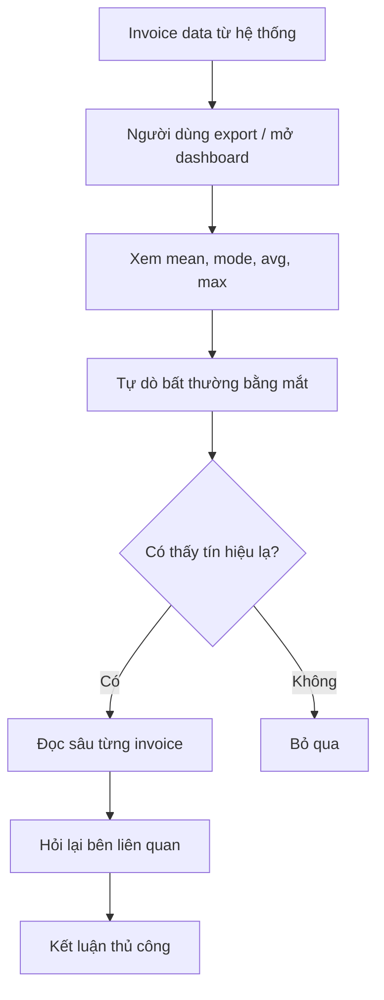
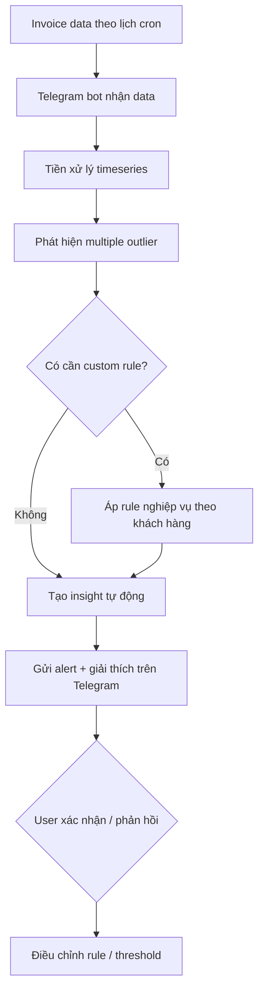

# 01 — Individual Problem Scan

> Mục tiêu của phần này là scan rộng trước khi hội tụ. Tôi giữ 5 ý tưởng AI khác nhau, sau đó chọn top 3 để pitch với nhóm. Ý tưởng tôi muốn đào sâu nhất là Telegram cron job bot đọc invoices timeseries để phát hiện outlier và trích insight theo custom nghiệp vụ của từng khách hàng.

## 1. Danh sách 5 ý tưởng AI

| # | Ý tưởng | Người gặp vấn đề | Vấn đề thật | Vì sao đáng xem xét |
|---|---|---|---|---|
| 1 | Telegram cron job bot phân tích outlier invoices | Kế toán / finance / ops | Mỗi ngày có nhiều invoice, khó nhìn ra giao dịch bất thường nếu chỉ xem mean, mode, avg, max | Có workflow lặp lại, có dữ liệu timeseries, có thể custom rule theo từng khách hàng |
| 2 | AI Sale Agent đa kênh | Shop online / sale | Tin nhắn đầu vào quá nhiều, phản hồi chậm, sàng lọc lead tốn thời gian | Workflow rõ, metric rõ, dễ vẽ before/after |
| 3 | AI weekly report assistant | PM / team lead | Mỗi tuần phải gom số liệu và viết narrative từ nhiều nguồn | Tốt cho workflow + narrative, dễ đo thời gian |
| 4 | AI support ticket triage | Customer support / ops | Ticket đến nhiều, phân loại thủ công chậm | Có thể route theo intent, priority, SLA |
| 5 | AI meeting action tracker | Team vận hành / PM | Sau họp hay rơi action item, khó follow-up | Có pain thật, nhiều bước lặp, dễ dùng AI để tóm tắt và nhắc việc |

## 2. Scan chi tiết từng ý tưởng

### 1) Telegram cron job bot phân tích outlier invoices

- **Actor:** kế toán, finance lead, ops manager, chủ shop.
- **Bối cảnh:** bot chạy theo cron trong Telegram, đọc dữ liệu invoice theo thời gian, phát hiện giao dịch bất thường hoặc pattern lạ.
- **Pain:** người dùng thường chỉ nhìn dashboard tổng quan như mean, mode, avg, max nhưng không thấy outlier có ý nghĩa kinh doanh.
- **Dấu hiệu thật:** invoice tăng đột biến, hóa đơn lặp, giao dịch lệch khung giờ, một khách hàng có pattern khác thường so với baseline.
- **Điểm mạnh:** có thể custom rule theo từng khách hàng, từng ngành, từng mốc thời gian.

### 2) AI Sale Agent đa kênh

- **Actor:** shop online, sale, khách hàng.
- **Bối cảnh:** khách nhắn trên Shopee, TikTok, Facebook, Zalo.
- **Pain:** sale không phản hồi kịp và phải lặp đi lặp lại cùng một kiểu hỏi đáp.
- **Dấu hiệu thật:** lead chờ lâu, spam nhiều, sale mất thời gian lọc.
- **Điểm mạnh:** metric rõ, workflow rõ, dễ pilot.

### 3) AI weekly report assistant

- **Actor:** PM, team lead, manager.
- **Bối cảnh:** cuối tuần hoặc đầu tuần phải tổng hợp report từ Jira, Sheets, Slack, docs.
- **Pain:** mất thời gian viết narrative.
- **Dấu hiệu thật:** lặp lại mỗi tuần, dễ trễ deadline.
- **Điểm mạnh:** AI làm tốt phần draft, người thật review được.

### 4) AI support ticket triage

- **Actor:** support agent, ops.
- **Bối cảnh:** ticket từ nhiều kênh đổ về một inbox.
- **Pain:** phân loại chậm, ticket urgent dễ bị chậm xử lý.
- **Dấu hiệu thật:** SLA trễ, ticket backlog tăng.
- **Điểm mạnh:** có thể route theo intent, mức độ khẩn, nhóm xử lý.

### 5) AI meeting action tracker

- **Actor:** team member, PM, manager.
- **Bối cảnh:** sau họp có nhiều action item, nhưng không ai theo dõi xuyên suốt.
- **Pain:** action bị rơi, phải hỏi lại nhiều lần.
- **Dấu hiệu thật:** meeting notes có nhiều việc nhưng thiếu owner hoặc deadline.
- **Điểm mạnh:** AI tóm tắt, nhắc việc, và theo dõi trạng thái.

## 3. Top 3 Problem Cards

### Top 1 — Telegram cron job bot phân tích outlier invoices

**Problem 1 câu:**
Mỗi ngày team finance phải đọc invoice timeseries và tự phát hiện outlier theo ngữ cảnh riêng của từng khách hàng, nhưng cách làm hiện tại chỉ dừng ở các thống kê tổng quát nên dễ bỏ sót tín hiệu quan trọng.

**Actor:**
Finance, kế toán, ops, owner.

**Workflow hiện tại:**

```text
1. Nhận invoice data theo ngày/tuần/tháng
2. Xem dashboard tổng quát
3. So sánh mean / mode / avg / max
4. Tự dò bất thường bằng mắt
5. Kết luận thủ công
6. Nếu nghi ngờ thì hỏi lại bên liên quan
```

**Bottleneck:**
Bước 4 và 5. Người xem phải tự suy ra outlier, trong khi mỗi khách hàng có định nghĩa bất thường khác nhau.

**Impact:**
Bỏ sót invoice bất thường, phát hiện muộn, khó giải thích insight cho business.

**Success metric:**
Giảm thời gian phát hiện outlier, tăng số outlier có ý nghĩa được phát hiện đúng, và giảm số case phải xem lại thủ công.

**Non-AI alternative:**
Rule-based threshold hoặc dashboard BI có thể báo alert cơ bản, nhưng khó tùy biến theo từng khách hàng và từng kiểu bất thường.

**AI hypothesis:**
AI đọc timeseries, nhận biết multiple outlier patterns, tóm tắt insight, và hỏi lại khi rule nghiệp vụ chưa đủ rõ.

**Quick gut:**
Agent kết hợp rule.

### Top 2 — AI Sale Agent đa kênh

**Problem 1 câu:**
Shop online mất nhiều lead vì phản hồi chậm và phải sàng lọc chat thủ công trước khi tư vấn.

**Actor:**
Shop online, sale.

**Bottleneck:**
Sale chỉ xử lý một thread tại một thời điểm.

**Metric:**
First response time, missed lead rate, conversion rate.

**Quick gut:**
Agent.

**Draft current workflow:**

```text
1. Khách nhắn tin trên kênh bán hàng
2. Sale đọc tin nhắn thủ công
3. Sale tự phân loại: spam / hỏi giá / có ý định mua
4. Sale trả lời từng câu hỏi lặp lại
5. Nếu có khả năng mua, sale hỏi thêm thông tin
6. Chốt đơn hoặc chuyển sale khác
```

**Draft future workflow:**

```text
1. Khách nhắn tin trên kênh bán hàng
2. AI phản hồi trong vài giây
3. AI phân loại intent và lọc spam
4. AI trả lời các câu hỏi lặp lại
5. AI hỏi thêm thông tin lead nếu cần
6. AI handoff cho sale khi đủ tín hiệu mua hoặc khi confidence thấp
```

### Top 3 — AI weekly report assistant

**Problem 1 câu:**
PM mất nhiều thời gian viết weekly report từ nhiều nguồn khác nhau và dễ trễ deadline.

**Actor:**
PM / team lead.

**Bottleneck:**
Viết narrative từ raw data.

**Metric:**
Giảm thời gian soạn report, giảm số lần sửa sau review.

**Quick gut:**
Workflow.

**Draft current workflow:**

```text
1. Mở Jira / Sheets / Slack
2. Tự gom số liệu từng nguồn
3. Đọc lại context tuần
4. Viết narrative bằng tay
5. Review và chỉnh format
6. Gửi cho team lead / manager
```

**Draft future workflow:**

```text
1. Auto pull data từ Jira / Sheets / Slack
2. AI cấu trúc dữ liệu đầu vào
3. AI draft narrative và highlight
4. PM review, sửa và bổ sung context
5. Gửi report cuối
```

## 4. Vì sao tôi chọn Telegram cron job bot là hướng mạnh nhất cho cá nhân

- Có dữ liệu dạng timeseries rõ ràng.
- Có bài toán phát hiện outlier cụ thể, không chỉ là thống kê mô tả.
- Có thể tùy biến nghiệp vụ theo từng khách hàng, từng ngành, từng ngưỡng bất thường.
- Có sự kết hợp hợp lý giữa rule, workflow và AI, thay vì để AI làm mọi thứ.
- Có tiềm năng thành sản phẩm thật vì đầu ra là insight, cảnh báo và giải thích, không chỉ là một report tĩnh.

## 5. Draft workflow cho Telegram cron job bot

### Workflow hiện tại



### Workflow sau tối ưu



### Điểm tôi muốn nhấn mạnh

1. Bot không chỉ tạo báo cáo mean/mode/avg/max.
2. Bot tập trung vào multiple outlier và giải thích vì sao nó là outlier.
3. Business rule của từng khách hàng là phần phải custom, không thể một threshold dùng cho tất cả.
4. Telegram chỉ là giao diện nhanh để nhận alert, feedback và điều chỉnh rule.

## 6. Kết luận scan

Sau vòng scan này, tôi thấy 2 ý tưởng mạnh nhất là:

1. Telegram cron job bot phân tích outlier invoices.
2. AI Sale Agent đa kênh.

Hai ý tưởng còn lại tôi giữ như candidate phụ để bảo đảm scan rộng, không bị khóa sớm vào một giải pháp.

---

*Day 02 Lab v2 — Individual Problem Scan*